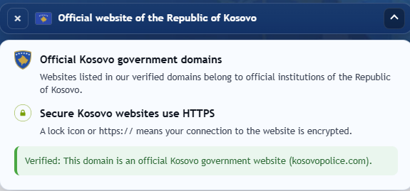
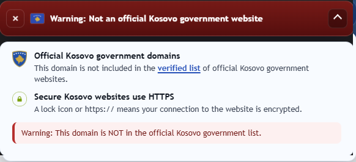

# Kontrolluesi i Domenëve të Qeverisë së Kosovës
Një extension që tregon nëse faqja që po vizitoni i përket një institucioni zyrtar të Republikës së Kosovës. Një banner i vogël shfaqet në krye të çdo faqeje.

> Banner blu -> Domen zyrtar i Qeverisë së Kosovës  
> Banner i kuq -> Nuk është domen zyrtar

Nuk mbledh të dhëna. Nuk dërgon kërkesa në rrjet. Funksionon tërësisht offline.

---

## Screenshots
### Official domain

### Unofficial domain

---

## Instalimi (Developer Mode)
1. Shkarko ose klono projektin
2. Hape `chrome://extensions/`
3. Aktivizo **Developer Mode**
4. Kliko **Load unpacked** dhe zgjedh folderin e projektit

---

## Gjuhët
Detektohen automatikisht nga `navigator.language`. Nëse gjuha nuk njihet, përdoret Anglishtja.

| Gjuha    | Kodi |
|----------|------|
| Anglisht | en   |
| Shqip    | sq   |
| Serbisht | sr   |

---

## Privatësia
Funksionon tërësisht offline. Lexon vetëm domenin e faqes aktuale; asgjë nuk mblidhet apo dërgohet jashtë.

---

## Licenca
[CC BY-NC-ND 4.0](https://creativecommons.org/licenses/by-nc-nd/4.0/) - Pa përdorim komercial, pa shpërndarje, pa fork.
